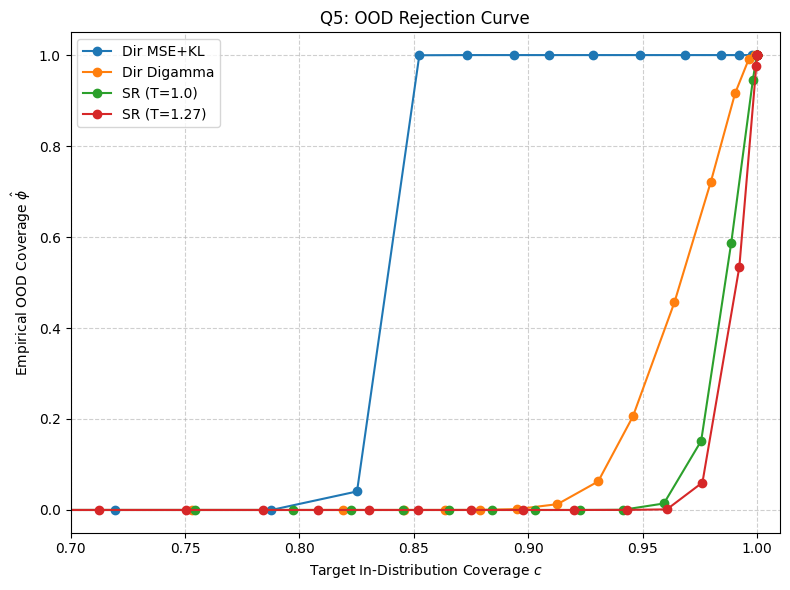

## Table: Q1 – Risk-Coverage Curves (Selective Classification)

<table>
<tr>
<td> TF Flowers</td>
<td> EuroSAT</td>
<td> APTOS</td>
</tr>
<tr>
<td> DermMNIST</td>
<td> TissueMNIST</td>
<td> CIFAR-10</td>
</tr>
<tr>
<td> SVHN</td>
<td></td>
<td></td>
</tr>
</table>

---

## Table: Q5 – OOD Rejection Curves

<table>
<tr>
<td> TF Flowers</td>
<td> EuroSAT</td>
<td> APTOS</td>
</tr>
<tr>
<td> DermMNIST</td>
<td> TissueMNIST</td>
<td> CIFAR-10</td>
</tr>
<tr>
<td> SVHN</td>
<td></td>
<td></td>
</tr>
</table>
