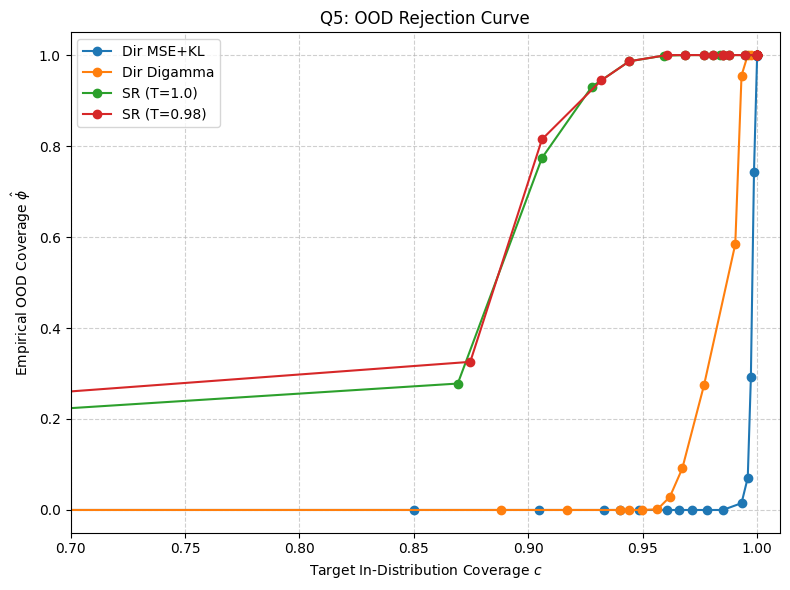
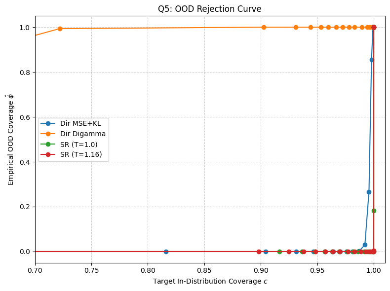
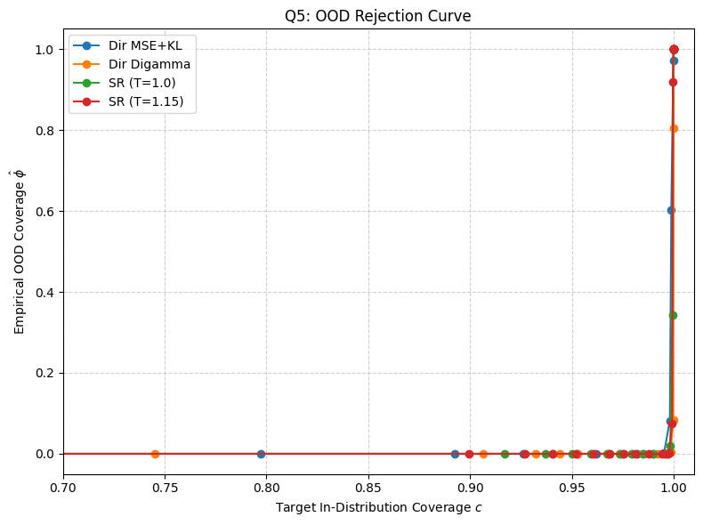
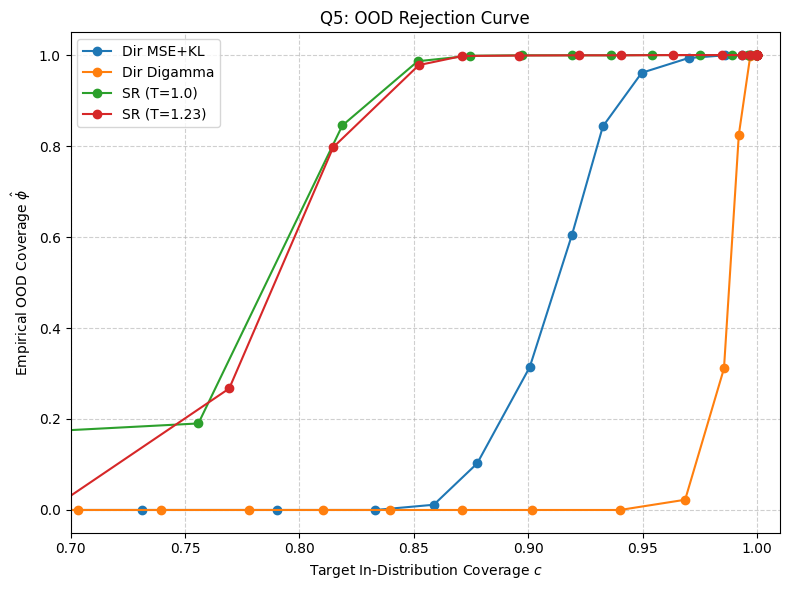
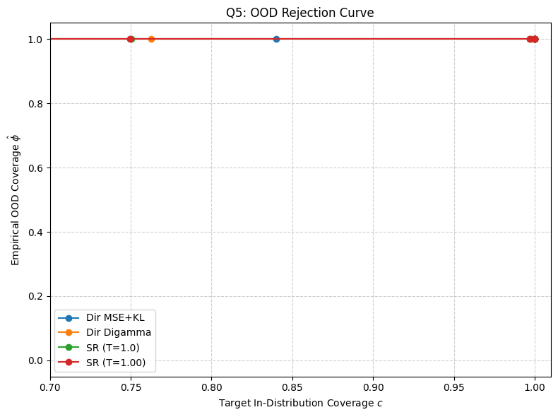

## Table: Q1 – Risk-Coverage Curves (Selective Classification)

<table>
<tr>
<td> TF Flowers CE: 96.6%, MSE: 97.4%,  Digamma: 97.8%</td>
<td> SVHN CE: 96.3%, MSE: 97.7%,  Digamma: 97.3%</td>
<td> CIFAR-10 CE: 96.3%, MSE: 97.4%,  Digamma: 97.8%</td>
</tr>
<tr>
<td> DermMNIST CE: 85.5%, MSE: 85.8%,  Digamma: 84.6%</td>
<td> TissueMNIST CE: 31.6%, MSE: 32.2%,  Digamma: 32.8%</td>
</tr>
</table>

---

## Table: Q5 – OOD Rejection Curves

<table>
<tr>
<td> TF Flowers</td>
<td> SVHN</td>
<td> CIFAR-10</td>
</tr>
<tr>
<td> DermMNIST</td>
<td> TissueMNIST</td>
</tr>
</table>
